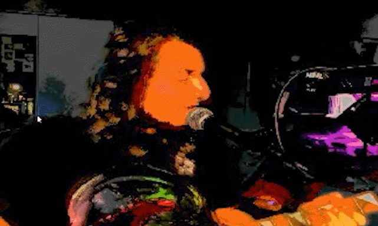
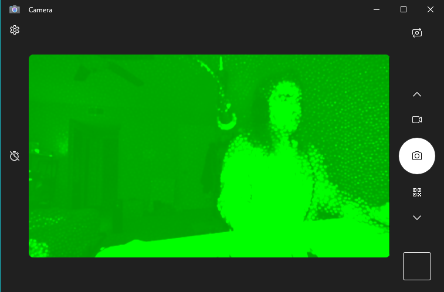
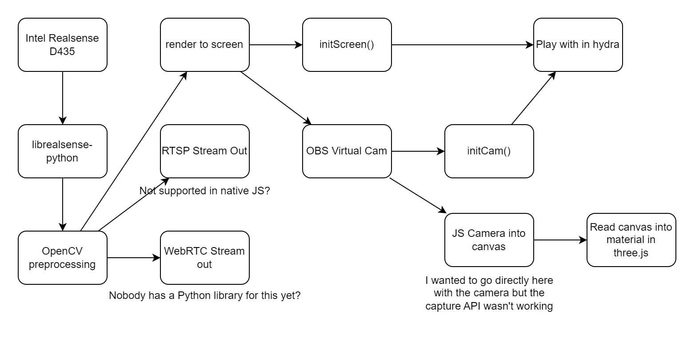
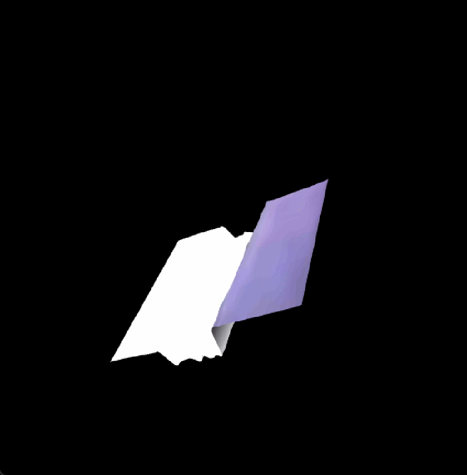

# Hydra Meetup 8 - starmaid

November 21, 2023 @ 7:00 am PST

## Who am I?

I'm starmaid, and I got into Hydra during the [2020 subculture zoom parties](https://www.youtube.com/watch?v=Z-Lvs-4r7Ak). The video effects during these were always very basic, and I knew there was a better way. I love using it during live performances, online or in person.



For this meetup, I want to bring in data from a depth camera and play with it in Three.js.

## Hardware

I had a few adventures getting the hardware set up. See my blog posts [here](https://www.nickmasso.com/projects/ps4-stereo-camera/) and [here](https://www.nickmasso.com/projects/intel-depth-camera/). Short answer, the intel D435 is working well now.

## Input

Intel's Windows drivers do expose the depth data, but it doesnt seem to be directly capturable like a normal webcam. 



Trying to select the camera in the firefox browser dialogue returns an error. Its not just hydra, even OBS and OpenCV were unable to.

```
06:52:25 ✨ choo editor:evalLine s1.initCam() 1ms bundle.min.js:20:159467
DOMException: Failed to allocate videosource
could not get camera TypeError: response is undefined       
    initCam https://unpkg.com/hydra-synth:2711
```

Because of this, I started looking at other ways to read the camera. One would be to read with the librealsense driver in python and then stream in a way that we can read it in JS. I can also render to screen. Check out this diagram.



## Three.js

Now that I have the data being read as a material, I want to do something interesting. 

The obvious thing would be to use it as a [displacement map](https://sbcode.net/threejs/displacmentmap/). See `test3.js`



I'm doing something wrong with the UV of the texture and the scale of the canvas, but you can see how the z-location of the mesh is being modified by the color of the mesh. Nice!

I really want to play with the full XYZ coordinates of each point as scanned by my camera. This will let me do some other funn effects, like modifying the mesh in more creative ways, or morphing into other meshes.

I'm still working on that.